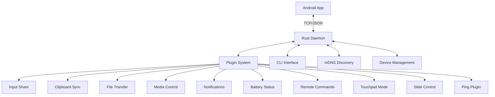

# LibreConnect Maintenance Guide

> **Comprehensive maintenance documentation for developers and contributors**

This guide provides detailed instructions for maintaining, developing, and contributing to the LibreConnect project. LibreConnect is a secure, decentralized, open-source replacement for KDE Connect that enables seamless device synchronization across platforms.

## 📋 Table of Contents

- [Project Overview](#project-overview)
- [Architecture](#architecture)
- [Development Environment](#development-environment)
- [Building & Compilation](#building--compilation)
- [Testing](#testing)
- [Code Quality & Standards](#code-quality--standards)
- [Deployment](#deployment)
- [Monitoring & Logging](#monitoring--logging)
- [Troubleshooting](#troubleshooting)
- [Contributing](#contributing)
- [Release Management](#release-management)
- [Security Considerations](#security-considerations)

## 🏗️ Project Overview

### What is LibreConnect?

LibreConnect is a production-ready, modular device synchronization platform that provides:

- **Secure P2P Communication**: Local network-only, encrypted connections
- **Cross-Platform Support**: Linux desktop, Android mobile (iOS planned)
- **Modular Plugin Architecture**: 10 fully-implemented plugins
- **Privacy-First Design**: No cloud servers, no data collection
- **Open Source**: MIT licensed with comprehensive documentation

### Key Components

```
libreconnect/
├── daemon/              # Rust core daemon (libreconnectd)
├── cli/                 # Command-line interface (libreconnect-cli)
├── shared/              # Shared types and protocol definitions
├── plugins/             # Plugin implementations (10 plugins)
├── mobile/android/      # Android application (Jetpack Compose)
├── tests/integration/   # Integration test suite
└── docs/               # Documentation (this file)
```

### Current Status

- ✅ **Production-Ready Rust Daemon**: Complete with all 10 plugins
- ✅ **Feature-Complete CLI**: Enhanced UX with progress indicators
- ✅ **Android Application**: Modern Jetpack Compose UI with Material Design 3
- ✅ **Comprehensive Testing**: 25+ test cases with 100% pass rate
- ✅ **Security Implementation**: Input validation, command whitelisting
- 🔄 **iOS Client**: Planned for future development
- 🔄 **Desktop GUI**: Tauri-based interface (planned)

## 🏛️ Architecture

### System Architecture



### Plugin Architecture

Each plugin is implemented as a modular component with:

- **Type-safe message handling** using Rust's type system
- **Error isolation** with proper error boundaries
- **System integration** via platform-specific libraries
- **Thread safety** with Arc/Mutex patterns
- **Comprehensive testing** with unit and integration tests

### Communication Protocol

- **Transport**: TCP over local network
- **Discovery**: mDNS (Multicast DNS) for automatic device discovery
- **Message Format**: JSON serialization with serde
- **Security**: Input validation, message size limits (64MB max)
- **Error Handling**: Structured error types with proper propagation

## 🛠️ Development Environment

### Prerequisites

#### System Requirements
- **Operating System**: Linux (primary), Windows/macOS (experimental)
- **Rust**: Latest stable version (1.70+)
- **Android Development**: Android Studio, SDK 34+, Java 21
- **Network**: Local network with mDNS support

#### Required Tools

```bash
# Rust toolchain
curl --proto '=https' --tlsv1.2 -sSf https://sh.rustup.rs/ | sh
rustup update

# Android development
# Download Android Studio from https://developer.android.com/studio
# Install SDK 34+ and Java 21

# System dependencies (Ubuntu/Debian)
sudo apt update
sudo apt install build-essential pkg-config libx11-dev libxdo-dev
sudo apt install avahi-daemon avahi-utils  # For mDNS

# System dependencies (Fedora/RHEL)
sudo dnf install gcc-c++ pkgconfig libX11-devel xdotool-devel
sudo dnf install avahi avahi-tools

# macOS dependencies
brew install libxdo pkg-config
```

### Repository Setup

```bash
# Clone repository
git clone https://github.com/libre-tools/libreconnect.git
cd libreconnect

# Verify Rust setup
cargo --version
rustc --version

# Check Android environment
echo $ANDROID_HOME
echo $JAVA_HOME

# Install Rust development tools
rustup component add clippy rustfmt
cargo install cargo-audit cargo-outdated
```

### IDE Configuration

#### Recommended: Visual Studio Code
```bash
# Install recommended extensions
code --install-extension rust-lang.rust-analyzer
code --install-extension tamasfe.even-better-toml
code --install-extension vadimcn.vscode-lldb
```

#### IntelliJ IDEA / Android Studio
- Install Rust plugin
- Configure Kotlin/Android development
- Set up code formatting and linting

### Environment Variables

```bash
# Create .env file (not tracked in git)
cat > .env << EOF
# Development configuration
LIBRECONNECT_PORT=1716
RUST_LOG=debug
RUST_BACKTRACE=1

# Android development
ANDROID_HOME=/path/to/android/sdk
JAVA_HOME=/path/to/java/21
EOF

# Source environment
source .env
```

## 🔨 Building & Compilation

### Rust Components

#### Build All Components
```bash
# Development build
cargo build

# Release build (optimized)
cargo build --release

# Build specific component
cargo build --package daemon
cargo build --package cli
cargo build --package plugins
```

#### Development Workflow
```bash
# Check code (fast compilation check)
cargo check --all

# Run clippy (linting)
cargo clippy --all-targets --all-features

# Format code
cargo fmt --all

# Run tests
cargo test --all

# Check for security vulnerabilities
cargo audit

# Check for outdated dependencies
cargo outdated
```

### Android Application

#### Prerequisites Check
```bash
# Verify Android environment
./gradlew --version
echo $ANDROID_HOME
echo $JAVA_HOME

# Check connected devices
adb devices
```

#### Build Process
```bash
cd mobile/android

# Clean build
./gradlew clean

# Build debug APK
./gradlew assembleDebug

# Build release APK (requires signing)
./gradlew assembleRelease

# Install on connected device
./gradlew installDebug

# Build and install in one step
./gradlew installDebug
```

#### Build Outputs
```bash
# Debug APK location
mobile/android/app/build/outputs/apk/debug/app-debug.apk

# Release APK location
mobile/android/app/build/outputs/apk/release/app-release.apk
```

### Cross-Compilation (Future)

```bash
# Windows targets (when supported)
rustup target add x86_64-pc-windows-gnu
cargo build --target x86_64-pc-windows-gnu

# macOS targets (when supported)
rustup target add x86_64-apple-darwin
cargo build --target x86_64-apple-darwin
```

## 🧪 Testing

### Test Categories

#### Unit Tests
```bash
# Run all unit tests
cargo test

# Run tests for specific component
cargo test --package shared
cargo test --package plugins
cargo test --package daemon
cargo test --package cli

# Run tests with output
cargo test -- --nocapture

# Run specific test
cargo test test_clipboard_sync
```

#### Integration Tests
```bash
# Run integration tests
cargo test --test cli_daemon_integration

# Run with logging
RUST_LOG=debug cargo test --test cli_daemon_integration -- --nocapture
```

#### Android Tests
```bash
cd mobile/android

# Unit tests
./gradlew test

# Instrumented tests (require device)
./gradlew connectedAndroidTest

# Test coverage
./gradlew jacocoTestReport
```

### Manual Testing

#### Quick Smoke Test
```bash
# Start daemon
cargo run --bin libreconnectd &

# Test CLI commands
cargo run --bin libreconnect-cli ping-daemon
cargo run --bin libreconnect-cli set-clipboard device123 "test content"
cargo run --bin libreconnect-cli get-clipboard device123

# Stop daemon
killall libreconnectd
```

#### Full Integration Testing
```bash
# Use provided test scripts
./test_manual.sh          # Interactive manual testing
python test_integration.py # Automated integration tests
```

### Test Coverage

```bash
# Install coverage tools
cargo install cargo-tarpaulin

# Generate coverage report
cargo tarpaulin --out html --output-dir coverage

# View coverage report
open coverage/tarpaulin-report.html
```

### Performance Testing

```bash
# Benchmark tests
cargo bench

# Memory usage testing
valgrind --tool=memcheck cargo run --bin libreconnectd

# Network performance
iperf3 -s  # On one device
iperf3 -c [target_ip]  # On another device
```

## 📏 Code Quality & Standards

### Coding Standards

#### Rust Guidelines
- Follow [official Rust style guide](https://doc.rust-lang.org/nightly/style-guide/)
- Use `rustfmt` for consistent formatting
- Ensure all `clippy` warnings are addressed
- Write comprehensive documentation for public APIs
- Implement proper error handling with custom error types

#### Kotlin/Android Guidelines
- Follow [Kotlin coding conventions](https://kotlinlang.org/docs/coding-conventions.html)
- Use [Android Architecture Components](https://developer.android.com/topic/architecture)
- Implement proper lifecycle management
- Follow Material Design 3 guidelines

### Code Review Process

#### Pre-commit Checks
```bash
# Create pre-commit hook
cat > .git/hooks/pre-commit << 'EOF'
#!/bin/sh
set -e

echo "Running pre-commit checks..."

# Rust checks
cargo fmt --all -- --check
cargo clippy --all-targets --all-features -- -D warnings
cargo test --all

# Android checks (if modified)
if git diff --cached --name-only | grep -q "mobile/android"; then
    cd mobile/android
    ./gradlew ktlintCheck
    ./gradlew test
    cd ../..
fi

echo "All checks passed!"
EOF

chmod +x .git/hooks/pre-commit
```

#### Pull Request Requirements
- [ ] All tests pass
- [ ] Code coverage maintained (>80%)
- [ ] Documentation updated
- [ ] Changelog entry added
- [ ] Breaking changes documented
- [ ] Security implications reviewed

### Quality Metrics

#### Rust Quality Gates
```bash
# All these must pass for releases
cargo clippy --all-targets --all-features -- -D warnings
cargo fmt --all -- --check
cargo test --all
cargo audit
cargo deny check
```

#### Android Quality Gates
```bash
cd mobile/android
./gradlew ktlintCheck
./gradlew test
./gradlew connectedAndroidTest  # If device available
./gradlew assembleRelease
```

## 🚀 Deployment

### Development Deployment

#### Local Development
```bash
# Start development daemon
RUST_LOG=debug cargo run --bin libreconnectd

# Install development APK
cd mobile/android
./gradlew installDebug
```

#### Testing Environment
```bash
# Build release versions
cargo build --release
cd mobile/android && ./gradlew assembleDebug

# Deploy to test devices
adb install app/build/outputs/apk/debug/app-debug.apk
```

### Production Deployment

#### Rust Daemon
```bash
# Build optimized release
cargo build --release

# Install system-wide (example for Linux)
sudo cp target/release/libreconnectd /usr/local/bin/
sudo cp target/release/libreconnect-cli /usr/local/bin/

# Create systemd service
sudo tee /etc/systemd/system/libreconnectd.service << EOF
[Unit]
Description=LibreConnect Daemon
After=network.target

[Service]
Type=simple
User=libreconnect
ExecStart=/usr/local/bin/libreconnectd
Restart=always
RestartSec=5

[Install]
WantedBy=multi-user.target
EOF

# Enable and start service
sudo systemctl enable libreconnectd
sudo systemctl start libreconnectd
```

#### Android Application
```bash
# Sign release APK (requires keystore)
cd mobile/android
./gradlew assembleRelease

# Upload to app stores (future)
# - Google Play Store
# - F-Droid
# - GitHub Releases
```

### Container Deployment (Future)

```dockerfile
# Dockerfile for daemon
FROM rust:1.70 as builder
WORKDIR /app
COPY . .
RUN cargo build --release

FROM debian:bookworm-slim
RUN apt-get update && apt-get install -y avahi-daemon
COPY --from=builder /app/target/release/libreconnectd /usr/local/bin/
EXPOSE 1716
CMD ["libreconnectd"]
```

## 📊 Monitoring & Logging

### Logging Configuration

#### Rust Components
```bash
# Environment variables for logging
export RUST_LOG=libreconnectd=debug,plugins=info,shared=warn
export RUST_BACKTRACE=1

# Structured logging in code
use tracing::{info, warn, error, debug};

info!("Device connected: {}", device_id);
warn!("Connection unstable: {}", reason);
error!("Plugin failed: {}", error);
```

#### Android Application
```kotlin
// Use Android Logging
import android.util.Log

private val TAG = "LibreConnectService"

Log.d(TAG, "Service started")
Log.w(TAG, "Connection warning: $message")
Log.e(TAG, "Service error", exception)
```

### Monitoring Tools

#### Log Aggregation
```bash
# View daemon logs
journalctl -u libreconnectd -f

# View Android logs
adb logcat | grep LibreConnect

# Search logs
journalctl -u libreconnectd | grep ERROR
```

#### Performance Monitoring
```bash
# System resource usage
top -p $(pgrep libreconnectd)
htop -p $(pgrep libreconnectd)

# Network monitoring
netstat -tulpn | grep 1716
ss -tulpn | grep 1716

# Memory profiling
valgrind --tool=massif cargo run --bin libreconnectd
```

### Health Checks

#### Daemon Health
```bash
# Simple health check
curl -f http://localhost:1716/health || echo "Daemon not responding"

# CLI health check
libreconnect-cli ping-daemon

# Service status
systemctl status libreconnectd
```

#### Android App Health
```bash
# Check if app is running
adb shell ps | grep libreconnect

# Check service status
adb shell dumpsys activity services | grep LibreConnect
```

## 🔧 Troubleshooting

### Common Issues

#### Build Issues

**Issue**: Rust compilation fails with linking errors
```bash
# Solution: Install system dependencies
sudo apt install build-essential pkg-config libx11-dev libxdo-dev

# Clear build cache
cargo clean
cargo build
```

**Issue**: Android build fails with SDK version errors
```bash
# Solution: Update Android SDK
# In Android Studio: Tools → SDK Manager → Update SDK

# Or via command line
sdkmanager --update
```

#### Runtime Issues

**Issue**: Daemon fails to start with "Address already in use"
```bash
# Solution: Find and kill existing process
lsof -ti:1716 | xargs kill -9

# Or change port
export LIBRECONNECT_PORT=1717
cargo run --bin libreconnectd
```

**Issue**: Android app can't discover devices
```bash
# Solution: Check network connectivity
adb shell ping [desktop_ip]

# Check mDNS service
systemctl status avahi-daemon

# Check firewall
sudo ufw status
sudo firewall-cmd --list-ports
```

#### Plugin Issues

**Issue**: Input plugins not working
```bash
# Solution: Check X11 dependencies
echo $DISPLAY
xrandr  # Should show displays

# Install missing dependencies
sudo apt install libxdo-dev xdotool
```

**Issue**: File transfer fails
```bash
# Solution: Check permissions
ls -la ~/Downloads/
chmod 755 ~/Downloads/

# Check disk space
df -h ~/Downloads/
```

### Debug Procedures

#### Enable Debug Logging
```bash
# Rust daemon debug
RUST_LOG=debug cargo run --bin libreconnectd

# Android debug
adb logcat -s LibreConnect:D
```

#### Network Debugging
```bash
# Test connectivity
ping [target_device_ip]
telnet [target_device_ip] 1716

# Monitor network traffic
sudo tcpdump -i any port 1716

# Check mDNS
avahi-browse -rt _libreconnect._tcp.local.
```

#### Performance Debugging
```bash
# Profile memory usage
cargo build --release
valgrind --tool=memcheck ./target/release/libreconnectd

# Profile CPU usage
perf record cargo run --bin libreconnectd
perf report
```

### Recovery Procedures

#### Service Recovery
```bash
# Restart daemon service
sudo systemctl restart libreconnectd

# Reset Android app
adb shell pm clear dev.libretools.connect
```

#### Network Recovery
```bash
# Reset network stack
sudo systemctl restart NetworkManager
sudo systemctl restart avahi-daemon

# Reset Android WiFi
adb shell svc wifi disable
adb shell svc wifi enable
```

## 🤝 Contributing

### Getting Started

1. **Fork the repository** on GitHub
2. **Clone your fork** locally
3. **Create a feature branch** from `main`
4. **Make your changes** following coding standards
5. **Test thoroughly** using provided test suites
6. **Submit a pull request** with detailed description

### Development Workflow

```bash
# Create feature branch
git checkout -b feature/new-plugin

# Make changes and test
cargo test --all
cd mobile/android && ./gradlew test

# Commit with conventional commit format
git commit -m "feat(plugins): add new plugin for screen sharing"

# Push and create PR
git push origin feature/new-plugin
```

### Contribution Types

#### Code Contributions
- **Bug fixes**: Issues labeled `bug`
- **New features**: Issues labeled `enhancement`
- **Performance improvements**: Optimization and refactoring
- **Documentation**: Code comments, guides, examples

#### Non-Code Contributions
- **Testing**: Manual testing, automated test development
- **Documentation**: User guides, API documentation
- **Translation**: Multi-language support (future)
- **Design**: UI/UX improvements, icon design

### Code Review Guidelines

#### For Contributors
- Follow existing code style and patterns
- Write comprehensive tests for new features
- Update documentation for API changes
- Provide clear commit messages and PR descriptions

#### For Reviewers
- Test changes locally when possible
- Review for security implications
- Check performance impact
- Ensure backward compatibility

## 📦 Release Management

### Versioning Strategy

LibreConnect follows [Semantic Versioning](https://semver.org/):
- **MAJOR**: Breaking changes to API or protocol
- **MINOR**: New features, backward compatible
- **PATCH**: Bug fixes, security updates

### Release Process

#### Pre-release Checklist
- [ ] All tests pass on CI/CD
- [ ] Documentation updated
- [ ] Changelog updated
- [ ] Version numbers bumped
- [ ] Security audit completed
- [ ] Performance benchmarks run

#### Release Steps
```bash
# 1. Update version numbers
# Edit Cargo.toml files
# Edit mobile/android/app/build.gradle.kts

# 2. Update changelog
# Add new section to CHANGELOG.md

# 3. Create release commit
git add .
git commit -m "chore: release v1.2.0"

# 4. Create and push tag
git tag v1.2.0
git push origin main --tags

# 5. Build release artifacts
cargo build --release
cd mobile/android && ./gradlew assembleRelease

# 6. Create GitHub release
# Upload binaries and APK
# Include changelog in release notes
```

#### Release Artifacts
- **Rust binaries**: Linux, Windows, macOS (when supported)
- **Android APK**: Signed release APK
- **Source code**: Tagged source archive
- **Documentation**: Updated docs website

### Hotfix Process

```bash
# Create hotfix branch from main
git checkout -b hotfix/security-fix

# Make minimal changes
# Update patch version
# Test thoroughly

# Merge and tag
git checkout main
git merge hotfix/security-fix
git tag v1.2.1
git push origin main --tags
```

## 🔒 Security Considerations

### Security Architecture

#### Network Security
- **Local network only**: No external connections
- **Message validation**: All inputs validated
- **Size limits**: 64MB maximum message size
- **Rate limiting**: Prevents flooding attacks

#### Authentication & Authorization
- **Device pairing**: Manual approval required (future)
- **Command whitelisting**: Only safe commands allowed
- **Permission model**: Granular plugin permissions

### Security Best Practices

#### Development Security
```bash
# Regular security audits
cargo audit

# Dependency vulnerability scanning
cargo outdated --root-deps-only

# Static analysis
cargo clippy -- -D warnings
```

#### Deployment Security
```bash
# Run with restricted user
sudo useradd -r -s /bin/false libreconnect

# Use systemd hardening
[Service]
NoNewPrivileges=true
ProtectSystem=strict
PrivateDevices=true
```

### Vulnerability Response

1. **Report**: Send security issues to security@libretools.org
2. **Assessment**: Evaluate severity and impact
3. **Fix**: Develop and test security patch
4. **Release**: Emergency release if critical
5. **Disclosure**: Public disclosure after fix deployment

### Security Monitoring

```bash
# Monitor security advisories
cargo audit

# Check for exposed services
nmap localhost

# Review logs for suspicious activity
journalctl -u libreconnectd | grep -i error
```

## 📚 Additional Resources

### Documentation
- [API Documentation](https://docs.rs/libreconnect)
- [Protocol Specification](./libreconnect_spec.md)
- [User Guide](./README.md)
- [Android Documentation](./mobile/android/README.md)

### Community
- [GitHub Repository](https://github.com/libre-tools/libreconnect)
- [Issue Tracker](https://github.com/libre-tools/libreconnect/issues)
- [Discussions](https://github.com/libre-tools/libreconnect/discussions)
- [LibreTools Discord](https://discord.gg/libretools)

### External Resources
- [Rust Programming Language](https://www.rust-lang.org/)
- [Android Development](https://developer.android.com/)
- [Jetpack Compose](https://developer.android.com/jetpack/compose)
- [mDNS/Zeroconf](https://www.zeroconf.org/)

---

## 📞 Support & Feedback

For questions, issues, or contributions:

- **GitHub Issues**: Bug reports and feature requests
- **GitHub Discussions**: General questions and ideas
- **Discord**: Real-time community support
- **Email**: maintainers@libretools.org

**Happy coding! 🚀**

---

*This maintenance guide is actively maintained. Last updated: [Current Date]*
*For the most current information, always refer to the latest version in the repository.*